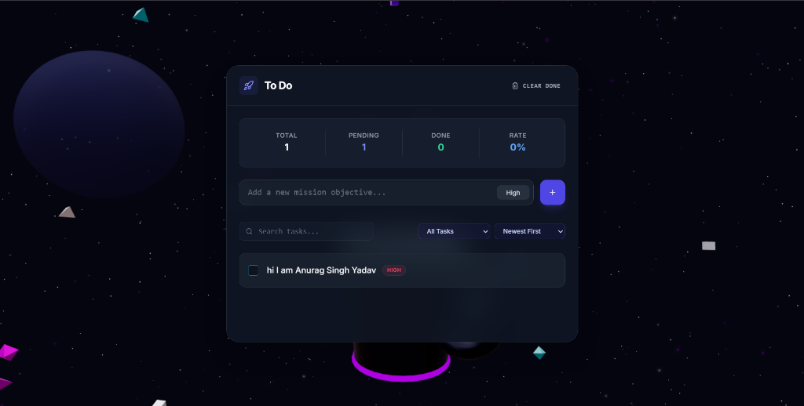

# 🚀 To Do

A **space-themed 3D task manager** — manage your mission objectives against an immersive WebGL background featuring a floating mug, drifting debris, and neon lighting.

## 📸 Preview



---

## ✨ Features

- **3D Scene** — Interactive WebGL background powered by `@react-three/fiber` with a floating mug, space debris, and a mouse-tracked camera rig
- **Task Management** — Add, complete, edit, and delete tasks ("mission objectives")
- **Priority Levels** — Low 🟢 / Medium 🟡 / High 🔴 color-coded badges
- **Filter & Sort** — Filter by status or priority; sort by newest, oldest, or highest priority
- **Search** — Real-time search across all tasks
- **Stats Dashboard** — Live summary of total, pending, and completed tasks
- **Persistent Storage** — Tasks saved to `localStorage` via Zustand `persist` — survive page refreshes

---

## 🛠️ Tech Stack

| Layer | Technology |
|---|---|
| Framework | React 18 + TypeScript |
| Bundler | Vite 5 |
| 3D Rendering | `@react-three/fiber` + `@react-three/drei` |
| Post-processing | `@react-three/postprocessing` |
| State Management | Zustand (with `persist` middleware) |
| Animations | Framer Motion |
| Styling | Tailwind CSS v3 |
| Icons | Lucide React |
| Date Utilities | date-fns |

---

## 📁 Project Structure

```
todo/
└── app/
    ├── src/
    │   ├── App.tsx                  # Root — mounts Canvas + UI overlay
    │   ├── Scene.tsx                # Three.js scene (lighting, camera, 3D objects)
    │   ├── UI.tsx                   # Main UI overlay (form, filters, task list)
    │   ├── store.ts                 # Zustand store — task state & actions
    │   ├── index.css                # Global styles & Tailwind directives
    │   ├── main.tsx                 # React entry point
    │   └── components/
    │       ├── CameraRig.tsx        # Mouse-reactive camera movement
    │       ├── Debris.tsx           # Floating space debris particles
    │       ├── Mug.tsx              # Animated 3D mug model
    │       ├── SpaceEnvironment.tsx # Stars, grid, and space backdrop
    │       ├── dashboard/
    │       │   ├── Stats.tsx        # Task statistics summary bar
    │       │   ├── TaskItem.tsx     # Individual task row (edit, delete, toggle)
    │       │   └── TaskList.tsx     # Filtered & sorted task list renderer
    │       └── ui/
    │           ├── Badge.tsx        # Priority badge component
    │           ├── Button.tsx       # Reusable button (primary / ghost variants)
    │           ├── Checkbox.tsx     # Animated checkbox
    │           └── Input.tsx        # Styled text input
    ├── index.html
    ├── package.json
    ├── tailwind.config.js
    └── vite.config.ts
```

---

## 🚀 Getting Started

### Prerequisites

- Node.js ≥ 18
- npm ≥ 9

### Install & Run

```bash
cd app
npm install
npm run dev
```

Opens at **[http://localhost:5173](http://localhost:5173)**

### Build for production

```bash
npm run build
```

---

## 🗂️ State Shape

Managed by Zustand in `src/store.ts`, persisted to `localStorage` under the key `antigravity-storage`.

```ts
interface Task {
  id: string
  text: string
  priority: 'low' | 'medium' | 'high'
  status: 'pending' | 'completed'
  createdAt: number
  updatedAt?: number
}
```

**Available actions:** `addTask`, `toggleTask`, `deleteTask`, `editTask`, `clearCompleted`, `setFilter`, `setSort`, `setSearch`

---

## 🎨 Design

- Dark space aesthetic with glassmorphism UI panel
- Neon cyan (`#00f3ff`) and magenta (`#ff00ff`) accent lighting
- Indigo primary color for interactive elements
- Backdrop-blur glass card floated over the 3D scene
